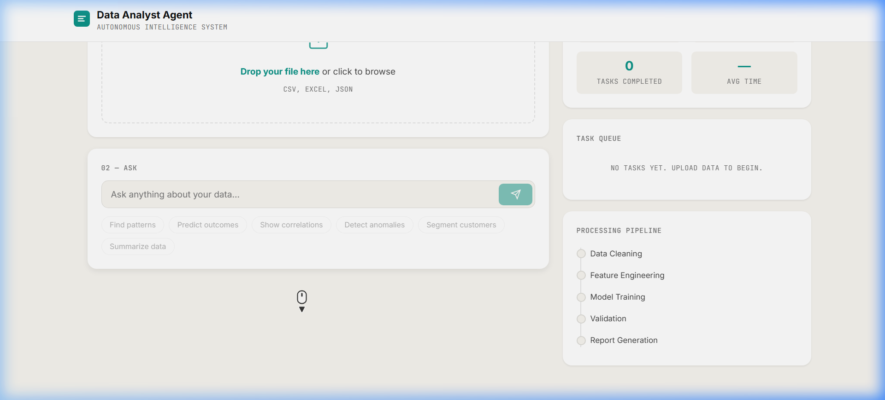
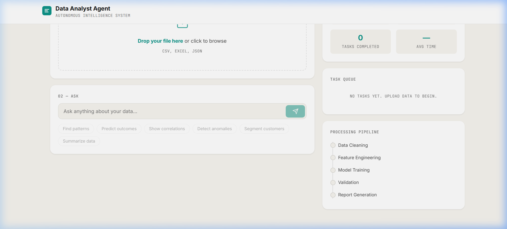
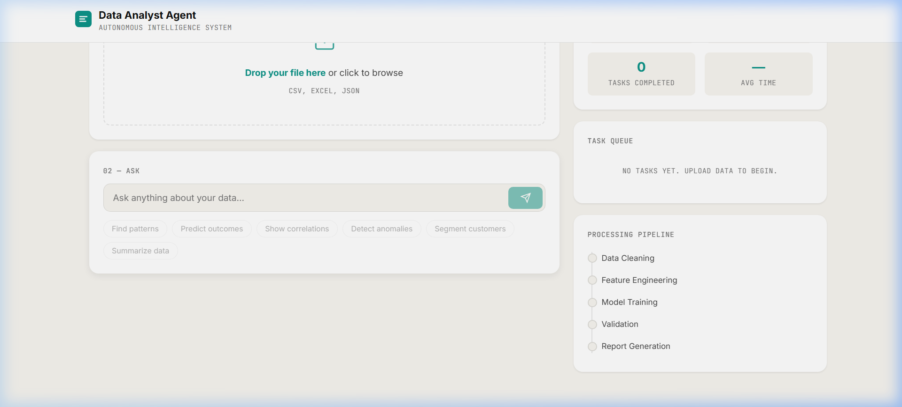

<div align="center">
  <h1>🤖 Autonomous Data Analyst Agent</h1>
  <p>An AI-powered autonomous agent that instantly cleans, profiles, and analyzes data using advanced machine learning, all presented in a beautiful editorial UI.</p>

  [](https://autonomous-data-analyst-agent.vercel.app/)
  [](https://github.com/Lalit-7/Autonomous-Data-Analyst-Agent)
</div>

<br />



## 🚀 Features

*   **Autonomous ML Detection:** Upload a CSV/Excel file, and the agent automatically determines the best machine learning task (Classification, Regression, Clustering, or Anomaly Detection).
*   **Conversational Analytics:** Ask questions in plain English (e.g., *"Find patterns"*, *"Predict outcomes"*).
*   **Beautiful Visualizations:** Automatically generated correlation matrices, distribution graphs, clustering plots, and anomaly scatter plots.
*   **Professional Reporting:** Generates clean, formatted insights with actionable metrics and a downloadable PDF export.
*   **History & Session Memory:** The agent remembers past steps using ChromaDB, allowing you to ask follow-up questions and navigate the task history seamlessly.

<br />

## 📸 Screenshots

### Correlation Matrix


### Cluster Segmentation Insights


### Distribution Charts


<br />

## 🛠️ Technology Stack

**Frontend:**
*   React + Vite
*   Tailwind / Vanilla CSS (Glassmorphism & Editorial aesthetics)
*   Recharts / Plotly (Data Visualization)
*   Deployed on **Vercel**

**Backend:**
*   Python + FastAPI
*   Google Gemini 2.5 Flash (LLM Inference)
*   Scikit-Learn & Pandas (Machine Learning & Data Processing)
*   ChromaDB (Vector Memory & State persistence)
*   Deployed on **Render**

<br />

## 💻 Run Locally

### 1. Clone the repository
```bash
git clone https://github.com/Lalit-7/Autonomous-Data-Analyst-Agent.git
cd "Autonomous Data Analyst Agent"
```

### 2. Start the Backend
You will need a Gemini API key (`GOOGLE_API_KEY`) and an E2B API key (`E2B_API_KEY`).
```bash
cd backend
python -m venv venv
venv\Scripts\activate  # Windows
# source venv/bin/activate  # Mac/Linux
pip install -r requirements.txt
cp .env.example .env  # Add your API keys here
python main.py
```

### 3. Start the Frontend
```bash
cd frontend
npm install
npm run dev
```

The app will be running at `http://localhost:5173/`.

<br />

## 📁 Project Structure

```text
📦 Autonomous Data Analyst Agent
 ┣ 📂 backend
 ┃ ┣ 📂 agent          # Core LLM workflows, LangGraph logic, and memory
 ┃ ┣ 📂 ml             # Scikit-learn models (analyzer) and plotting (visualizer)
 ┃ ┣ 📂 utils          # PDF generators and file handlers
 ┃ ┣ 📜 main.py        # FastAPI endpoints
 ┃ ┗ 📜 requirements.txt
 ┣ 📂 frontend
 ┃ ┣ 📂 src
 ┃ ┃ ┣ 📂 components   # React UI components (Sidebar, Charts, Chat, etc.)
 ┃ ┃ ┣ 📂 services     # API handlers to communicate with the backend
 ┃ ┃ ┗ 📜 App.jsx      # Main application logic
 ┃ ┗ 📜 package.json
 ┗ 📜 README.md
```

<div align="center">
  <p>Built by <a href="https://github.com/Lalit-7">Lalit-7</a></p>
</div>
